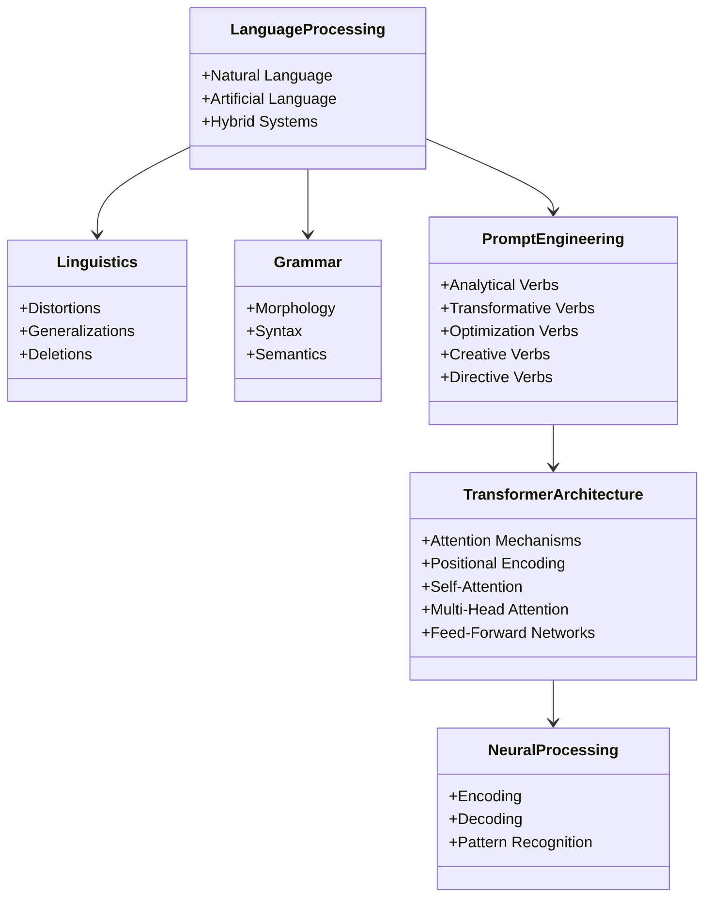

```mermaid
classDiagram
    class LanguageProcessing{
        +Natural Language
        +Artificial Language
        +Hybrid Systems
    }

    class Linguistics{
        +Distortions
        +Generalizations
        +Deletions
    }

    class Grammar{
        +Morphology
        +Syntax
        +Semantics
    }

    class PromptEngineering{
        +Analytical Verbs
        +Transformative Verbs
        +Optimization Verbs
        +Creative Verbs
        +Directive Verbs
    }

    class TransformerArchitecture{
        +Attention Mechanisms
        +Positional Encoding
        +Self-Attention
        +Multi-Head Attention
        +Feed-Forward Networks
    }

    class NeuralProcessing{
        +Encoding
        +Decoding
        +Pattern Recognition
    }

    LanguageProcessing --> Linguistics
    LanguageProcessing --> Grammar
    LanguageProcessing --> PromptEngineering
    PromptEngineering --> TransformerArchitecture
    TransformerArchitecture --> NeuralProcessing
```