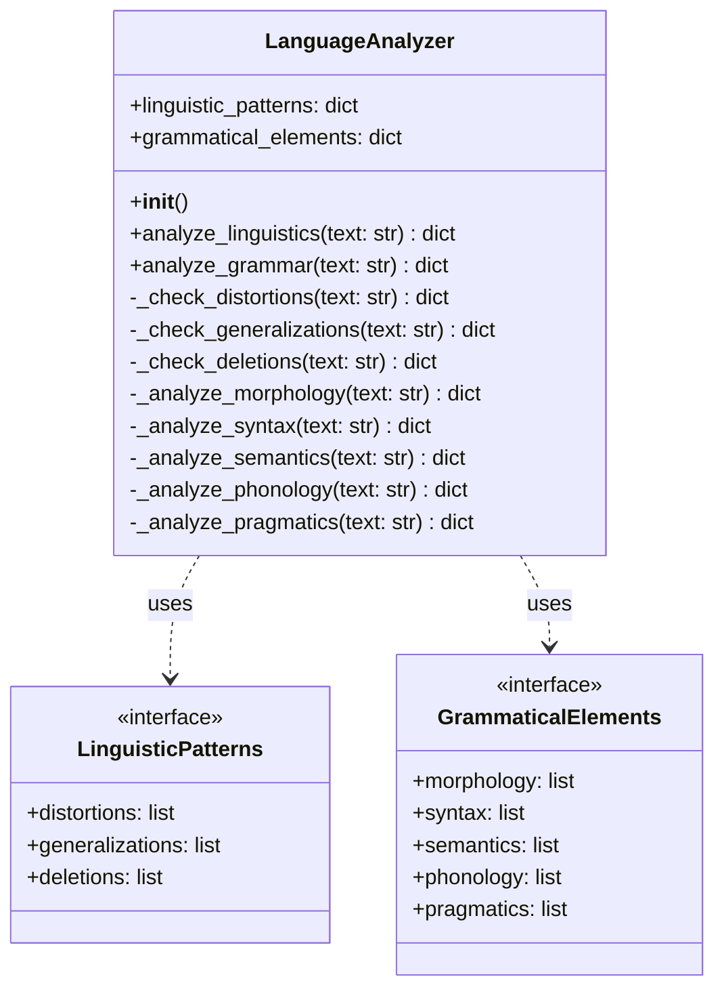

```mermaid
classDiagram
    class LanguageAnalyzer {
        +linguistic_patterns: dict
        +grammatical_elements: dict
        +__init__()
        +analyze_linguistics(text: str) dict
        +analyze_grammar(text: str) dict
        -_check_distortions(text: str) dict
        -_check_generalizations(text: str) dict
        -_check_deletions(text: str) dict
        -_analyze_morphology(text: str) dict
        -_analyze_syntax(text: str) dict
        -_analyze_semantics(text: str) dict
        -_analyze_phonology(text: str) dict
        -_analyze_pragmatics(text: str) dict
    }

    class LinguisticPatterns {
        <<interface>>
        +distortions: list
        +generalizations: list
        +deletions: list
    }

    class GrammaticalElements {
        <<interface>>
        +morphology: list
        +syntax: list
        +semantics: list
        +phonology: list
        +pragmatics: list
    }

    LanguageAnalyzer ..> LinguisticPatterns : uses
    LanguageAnalyzer ..> GrammaticalElements : uses
```