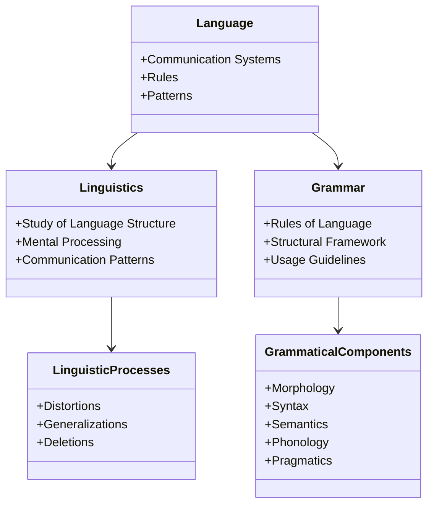

```mermaid
classDiagram
    class Language{
        +Communication Systems
        +Rules
        +Patterns
    }

    class Linguistics{
        +Study of Language Structure
        +Mental Processing
        +Communication Patterns
    }

    class Grammar{
        +Rules of Language
        +Structural Framework
        +Usage Guidelines
    }

    class LinguisticProcesses{
        +Distortions
        +Generalizations
        +Deletions
    }

    class GrammaticalComponents{
        +Morphology
        +Syntax
        +Semantics
        +Phonology
        +Pragmatics
    }

    Language --> Linguistics
    Language --> Grammar
    Linguistics --> LinguisticProcesses
    Grammar --> GrammaticalComponents
    
```