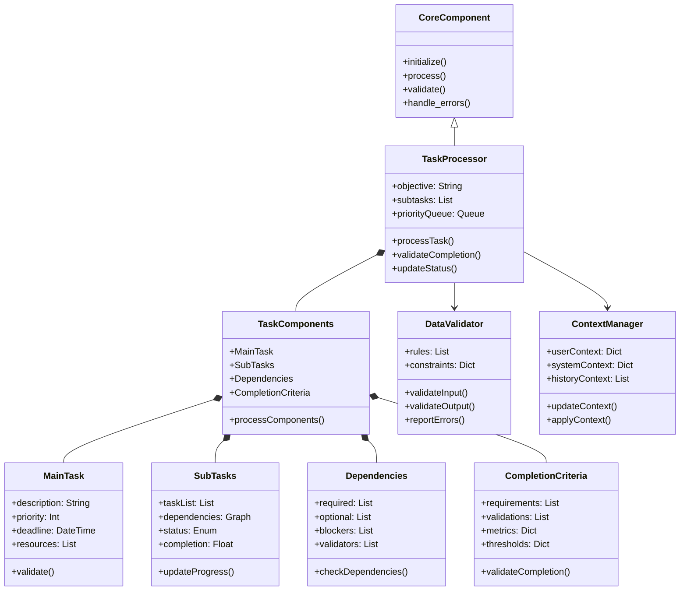

```mermaid
classDiagram
    class CoreComponent{
        +initialize()
        +process()
        +validate()
        +handle_errors()
    }

    class TaskProcessor{
        +objective: String
        +subtasks: List
        +priorityQueue: Queue
        +processTask()
        +validateCompletion()
        +updateStatus()
    }

    class TaskComponents{
        +MainTask
        +SubTasks
        +Dependencies
        +CompletionCriteria
        +processComponents()
    }

    class MainTask{
        +description: String
        +priority: Int
        +deadline: DateTime
        +resources: List
        +validate()
    }

    class SubTasks{
        +taskList: List
        +dependencies: Graph
        +status: Enum
        +completion: Float
        +updateProgress()
    }

    class Dependencies{
        +required: List
        +optional: List
        +blockers: List
        +validators: List
        +checkDependencies()
    }

    class CompletionCriteria{
        +requirements: List
        +validations: List
        +metrics: Dict
        +thresholds: Dict
        +validateCompletion()
    }

    class DataValidator{
        +rules: List
        +constraints: Dict
        +validateInput()
        +validateOutput()
        +reportErrors()
    }

    class ContextManager{
        +userContext: Dict
        +systemContext: Dict
        +historyContext: List
        +updateContext()
        +applyContext()
    }

    CoreComponent <|-- TaskProcessor
    TaskProcessor *-- TaskComponents
    TaskComponents *-- MainTask
    TaskComponents *-- SubTasks
    TaskComponents *-- Dependencies
    TaskComponents *-- CompletionCriteria
    TaskProcessor --> DataValidator
    TaskProcessor --> ContextManager
```