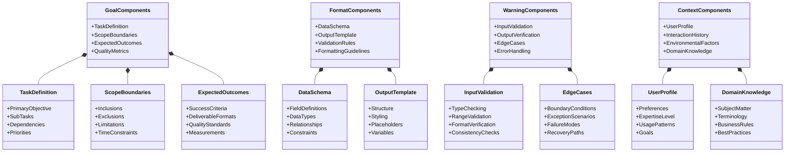

```mermaid
classDiagram
    class GoalComponents{
        +TaskDefinition
        +ScopeBoundaries
        +ExpectedOutcomes
        +QualityMetrics
    }

    class TaskDefinition{
        +PrimaryObjective
        +SubTasks
        +Dependencies
        +Priorities
    }

    class ScopeBoundaries{
        +Inclusions
        +Exclusions
        +Limitations
        +TimeConstraints
    }

    class ExpectedOutcomes{
        +SuccessCriteria
        +DeliverableFormats
        +QualityStandards
        +Measurements
    }

    class FormatComponents{
        +DataSchema
        +OutputTemplate
        +ValidationRules
        +FormattingGuidelines
    }

    class DataSchema{
        +FieldDefinitions
        +DataTypes
        +Relationships
        +Constraints
    }

    class OutputTemplate{
        +Structure
        +Styling
        +Placeholders
        +Variables
    }

    class WarningComponents{
        +InputValidation
        +OutputVerification
        +EdgeCases
        +ErrorHandling
    }

    class InputValidation{
        +TypeChecking
        +RangeValidation
        +FormatVerification
        +ConsistencyChecks
    }

    class EdgeCases{
        +BoundaryConditions
        +ExceptionScenarios
        +FailureModes
        +RecoveryPaths
    }

    class ContextComponents{
        +UserProfile
        +InteractionHistory
        +EnvironmentalFactors
        +DomainKnowledge
    }

    class UserProfile{
        +Preferences
        +ExpertiseLevel
        +UsagePatterns
        +Goals
    }

    class DomainKnowledge{
        +SubjectMatter
        +Terminology
        +BusinessRules
        +BestPractices
    }

    GoalComponents *-- TaskDefinition
    GoalComponents *-- ScopeBoundaries
    GoalComponents *-- ExpectedOutcomes

    FormatComponents *-- DataSchema
    FormatComponents *-- OutputTemplate

    WarningComponents *-- InputValidation
    WarningComponents *-- EdgeCases

    ContextComponents *-- UserProfile
    ContextComponents *-- DomainKnowledge
```