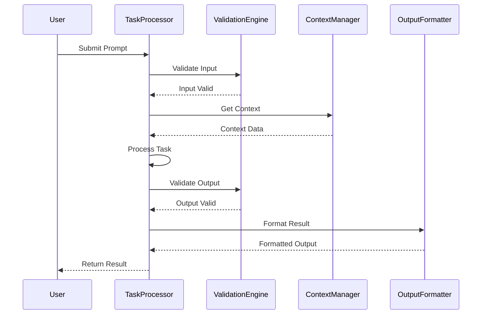

```mermaid
sequenceDiagram
    participant User
    participant TaskProcessor
    participant ValidationEngine
    participant ContextManager
    participant OutputFormatter

    User->>TaskProcessor: Submit Prompt

    TaskProcessor->>ValidationEngine: Validate Input
    ValidationEngine-->>TaskProcessor: Input Valid

    TaskProcessor->>ContextManager: Get Context
    ContextManager-->>TaskProcessor: Context Data

    TaskProcessor->>TaskProcessor: Process Task

    TaskProcessor->>ValidationEngine: Validate Output
    ValidationEngine-->>TaskProcessor: Output Valid

    TaskProcessor->>OutputFormatter: Format Result
    OutputFormatter-->>TaskProcessor: Formatted Output

    TaskProcessor-->>User: Return Result
```