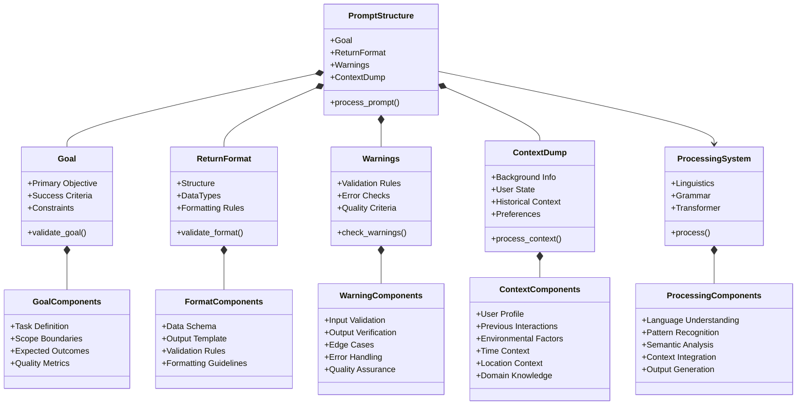

```mermaid
classDiagram
    class PromptStructure{
        +Goal
        +ReturnFormat
        +Warnings
        +ContextDump
        +process_prompt()
    }

    class Goal{
        +Primary Objective
        +Success Criteria
        +Constraints
        +validate_goal()
    }

    class GoalComponents{
        +Task Definition
        +Scope Boundaries
        +Expected Outcomes
        +Quality Metrics
    }

    class ReturnFormat{
        +Structure
        +DataTypes
        +Formatting Rules
        +validate_format()
    }

    class FormatComponents{
        +Data Schema
        +Output Template
        +Validation Rules
        +Formatting Guidelines
    }

    class Warnings{
        +Validation Rules
        +Error Checks
        +Quality Criteria
        +check_warnings()
    }

    class WarningComponents{
        +Input Validation
        +Output Verification
        +Edge Cases
        +Error Handling
        +Quality Assurance
    }

    class ContextDump{
        +Background Info
        +User State
        +Historical Context
        +Preferences
        +process_context()
    }

    class ContextComponents{
        +User Profile
        +Previous Interactions
        +Environmental Factors
        +Time Context
        +Location Context
        +Domain Knowledge
    }

    class ProcessingSystem{
        +Linguistics
        +Grammar
        +Transformer
        +process()
    }

    class ProcessingComponents{
        +Language Understanding
        +Pattern Recognition
        +Semantic Analysis
        +Context Integration
        +Output Generation
    }

    PromptStructure *-- Goal
    PromptStructure *-- ReturnFormat
    PromptStructure *-- Warnings
    PromptStructure *-- ContextDump
    PromptStructure --> ProcessingSystem

    Goal *-- GoalComponents
    ReturnFormat *-- FormatComponents
    Warnings *-- WarningComponents
    ContextDump *-- ContextComponents
    ProcessingSystem *-- ProcessingComponents
```