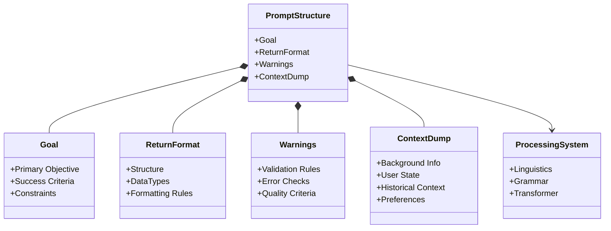

```mermaid
classDiagram
    class PromptStructure{
        +Goal
        +ReturnFormat
        +Warnings
        +ContextDump
    }

    class Goal{
        +Primary Objective
        +Success Criteria
        +Constraints
    }

    class ReturnFormat{
        +Structure
        +DataTypes
        +Formatting Rules
    }

    class Warnings{
        +Validation Rules
        +Error Checks
        +Quality Criteria
    }

    class ContextDump{
        +Background Info
        +User State
        +Historical Context
        +Preferences
    }

    class ProcessingSystem{
        +Linguistics
        +Grammar
        +Transformer
    }

    PromptStructure *-- Goal
    PromptStructure *-- ReturnFormat
    PromptStructure *-- Warnings
    PromptStructure *-- ContextDump
    PromptStructure --> ProcessingSystem
```