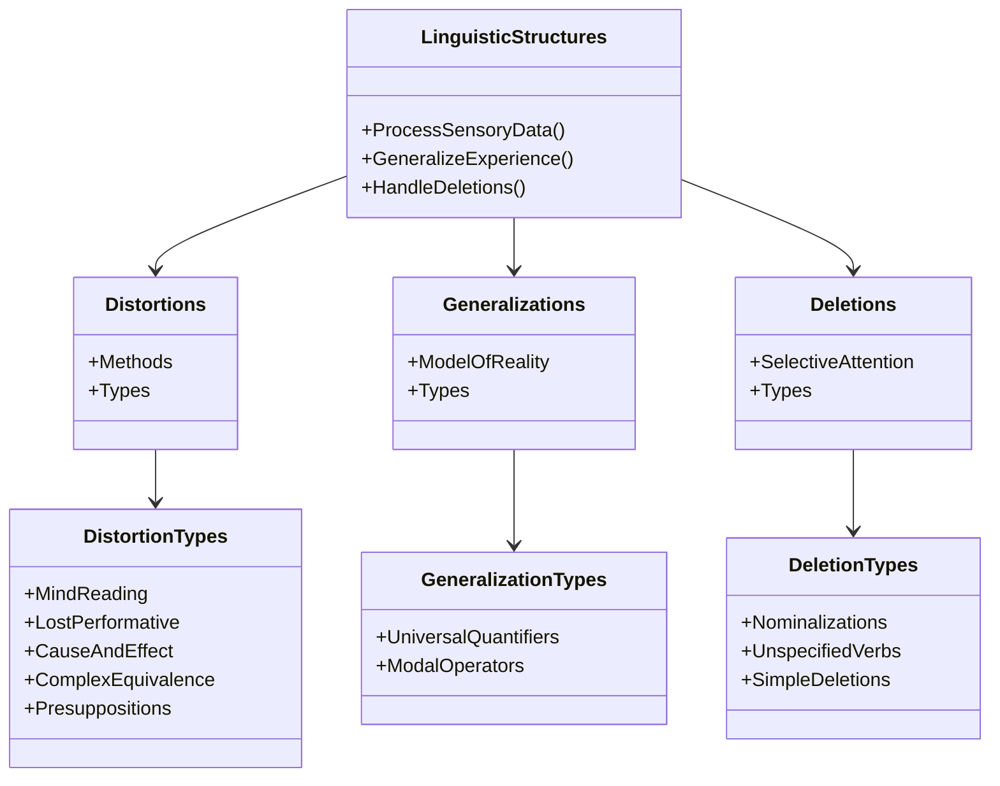

```mermaid
classDiagram
    class LinguisticStructures {
        +ProcessSensoryData()
        +GeneralizeExperience()
        +HandleDeletions()
    }

    class Distortions {
        +Methods
        +Types
    }

    class DistortionTypes {
        +MindReading
        +LostPerformative
        +CauseAndEffect
        +ComplexEquivalence
        +Presuppositions
    }

    class Generalizations {
        +ModelOfReality
        +Types
    }

    class GeneralizationTypes {
        +UniversalQuantifiers
        +ModalOperators
    }

    class Deletions {
        +SelectiveAttention
        +Types
    }

    class DeletionTypes {
        +Nominalizations
        +UnspecifiedVerbs
        +SimpleDeletions
    }

    LinguisticStructures --> Distortions
    LinguisticStructures --> Generalizations
    LinguisticStructures --> Deletions

    Distortions --> DistortionTypes
    Generalizations --> GeneralizationTypes
    Deletions --> DeletionTypes
```