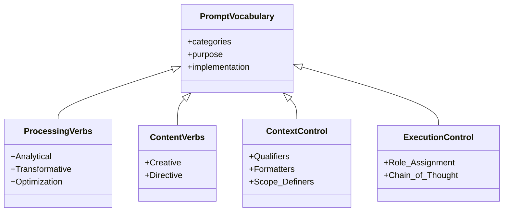

```mermaid
classDiagram
    class PromptVocabulary {
        +categories
        +purpose
        +implementation
    }

    class ProcessingVerbs {
        +Analytical
        +Transformative
        +Optimization
    }

    class ContentVerbs {
        +Creative
        +Directive
    }

    class ContextControl {
        +Qualifiers
        +Formatters
        +Scope_Definers
    }

    class ExecutionControl {
        +Role_Assignment
        +Chain_of_Thought
    }

    PromptVocabulary <|-- ProcessingVerbs
    PromptVocabulary <|-- ContentVerbs
    PromptVocabulary <|-- ContextControl
    PromptVocabulary <|-- ExecutionControl
```