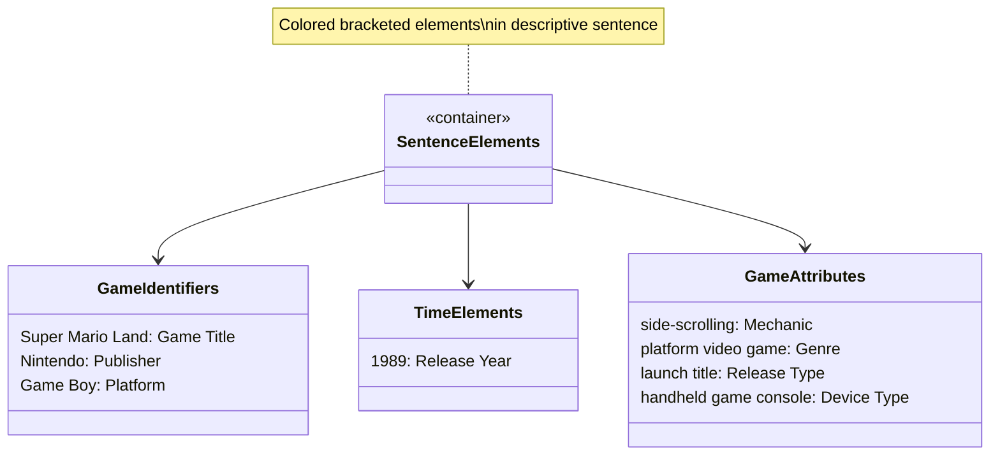

```mermaid
classDiagram
    class SentenceElements {
        <<container>>
    }
    class GameIdentifiers {
        Super Mario Land: Game Title
        Nintendo: Publisher
        Game Boy: Platform
    }
    class TimeElements {
        1989: Release Year
    }
    class GameAttributes {
        side-scrolling: Mechanic
        platform video game: Genre
        launch title: Release Type
        handheld game console: Device Type
    }

    SentenceElements --> GameIdentifiers
    SentenceElements --> TimeElements
    SentenceElements --> GameAttributes

    note for SentenceElements "Colored bracketed elements\nin descriptive sentence"
```